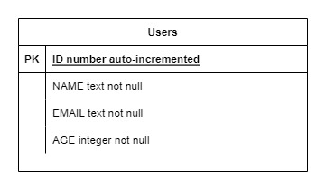

# API OzMap

## Tabela de Conteúdos

- [Visão Geral](#1-visão-geral)
- [Diagrama ER](#2-diagrama-er)
- [Início Rápido](#3-início-rápido)
  - [Instalando Dependências](#31-instalando-dependências)
  - [Variáveis de Ambiente](#32-variáveis-de-ambiente)
  - [Scripts](#33-scripts)
  - [Banco de dados](#34-banco-de-dados)
- [Endpoints](#4-endpoints)
- [Desenvolvedores](#5-desenvolvedores)

---

## 1. Visão Geral

Visão geral do projeto, um pouco das tecnologias usadas.

- [NodeJS](https://nodejs.org/en/)
- [Koajs](https://koajs.com/)
- [sqlite3](https://www.sqlite.org/index.html)
- [TypeORM](https://typeorm.io/)
- [Dotenv](https://www.npmjs.com/package/dotenv)
- [Cross-env](https://www.npmjs.com/package/cross-env)
- [Envalid](https://www.npmjs.com/package/envalid)
- [HTTP Graceful Shutdown](https://www.npmjs.com/package/http-graceful-shutdown)
- [Koa2-Swagger UI](https://www.npmjs.com/package/koa2-swagger-ui)
- [YamlJs](https://www.npmjs.com/package/yamljs)
- [Chai](https://www.chaijs.com/)
- [Mocha](https://mochajs.org/)

---

## 2. Diagrama ER

[ Voltar para o topo ](#tabela-de-conteúdos)

Diagrama ER da API definindo bem as relações entre as tabelas do banco de dados.

<div align="center">
   
</div>

---

## 3. Início Rápido

[ Voltar para o topo ](#tabela-de-conteúdos)

### 3.1. Instalando Dependências

Clone o projeto em sua máquina e instale as dependências com o comando:

```shell
npm install
```

### 3.2. Variáveis de Ambiente

Crie um arquivo **.env** na raíz do projeto, copie e preencha os valores para as chaves presentes do arquivo **.env.example** dentro do arquivo **.env**.

### 3.3. Scripts

Executar aplicação em ambiente de desenvolvimento:

```
npm run dev
```

- Após executar a aplicação em desenvolvimento é possível acessar a documentação da API com o Swagger-UI na rota: http://localhost:3000/swagger

Executar aplicação em ambiente de testes:

```
npm test
```

### 3.4. Banco de dados

O banco de dados será iniciado em um arquivo chamado database.sqlite após utilização de qualquer um do script para ambiente de desenvolvimento, já no ambiente de testes, o banco de dados utilizado será o dbtest.sqlite, que será criado automáticamente após a execução do script.

IMPORTANTE: Após a primeira execução dos testes um teste apresentará erro pois a conexão com o banco é perdida e logo após é reestabelecida para o teste seguinte, porém, ao executar o script outras vezes (com o arquivo dbtest.sqlite na raíz do projeto) o erro deixa de existir e todos os testes ficam funcionais. Devido esse erro de conexão não foi possível guardar os dados apenas em memória e para isso o arquivo dbtest.sqlite é criado automáticamente após a primeira execução e sempre é zerado ao fim dos testes.

---

## 4. Endpoints

[ Voltar para o topo ](#tabela-de-conteúdos)

### Índice

- [User](#1-User)

---

## 1. **User**

[ Voltar para o topo ](#tabela-de-conteúdos)

### Endpoints

| Método | Rota                      | Descrição                                                                  |
| ------ | ------------------------- | -------------------------------------------------------------------------- |
| POST   | /user                     | Criação de um usuário.                                                     |
| GET    | /users/?page={numberPage} | Lista todos os usuários por paginação, a rota aceita o query-param "page". |
| GET    | /user/:name               | Lista um usuário usando seu nome como parâmetro                            |
| PATCH  | /user/:name               | Editar as informações do usuário usando seu nome como parâmetro            |
| DELETE | /user/:name               | Deletar usuário usando seu nome como parâmetro                             |
| DELETE | /users/all                | Deletar todos os usuários da aplicação                                     |
| GET    | /swagger                  | Documentação da API com Swagger-UI                                         |

---

### 1.1. **Criação de Usuário**

### `POST/user`

### Exemplo de Request:

```
POST /user
Host: http://localhost:3000
Authorization: None
Content-type: application/json
```

### Exemplo de Corpo da Requisição:

```json
{
  "name": "Wesley",
  "email": "Wesley@mail.com",
  "age": 18
}
```

Todos os campos são obrigatórios.

### Exemplo de Response:

```
201 Created
```

```json
{
  "name": "Wesley",
  "email": "wesley@mail.com",
  "age": 18,
  "id": 1
}
```

O campo name não deve ser único no banco de dados, o campo age deve apresentar um valor numérico maior que 18.

### Possíveis Erros:

| Código do Erro  | Descrição                                       |
| --------------- | ----------------------------------------------- |
| 400 Bad request | 'age', 'email' and 'name' are mandatory fields. |
| 400 Bad request | User must be over 18 years old.                 |
| 409 Conflict    | User already exists.                            |

---

### 1.2. **Listando Usuários**

### `GET/users/?page={pageNumber}`

### Exemplo de Request:

```
GET/users/?page=3
Host: http://localhost:3000
Content-type: None
```

### Parâmetros da Requisição:

| Parâmetro          | Tipo   | Descrição                                                                    |
| ------------------ | ------ | ---------------------------------------------------------------------------- |
| ?page={pageNumber} | number | Query-param utilizado para selecionar a página de registros a ser retornada. |

### Corpo da Requisição:

```json
Vazio
```

### Exemplo de Response:

```
200 OK
```

```json
{
  "total": 11,
  "count": 11,
  "nextPage": null,
  "rows": [
    {
      "id": 12,
      "name": "Wesley6",
      "email": "wesley@mail.com",
      "age": 22
    }
  ]
}
```

---

### 1.3. **Listar Usuário por nome**

### `GET/user/:name`

### Exemplo de Request:

```
GET/user/Wesley
Host: http://localhost:3000
Content-type: None
```

### Parâmetros da Requisição:

| Parâmetro | Tipo   | Descrição                             |
| --------- | ------ | ------------------------------------- |
| name      | string | Identificador único do usuário (User) |

### Corpo da Requisição:

```json
Vazio
```

### Exemplo de Response:

```
200 OK
```

```json
{
  "id": 7,
  "name": "Wesley",
  "email": "wesley@mail.com",
  "age": 22
}
```

### Possíveis Erros:

| Código do Erro | Descrição       |
| -------------- | --------------- |
| 404 Not Found  | User not found. |

---

### 1.4. **Editar Usuário por nome**

### `PATCH/user/:name`

### Exemplo de Request:

```
PATCH/user/Wesley
Host: http://localhost:3000
Content-type: application/json
```

### Parâmetros da Requisição:

| Parâmetro          | Tipo   | Descrição                                                                    |
| ------------------ | ------ | ---------------------------------------------------------------------------- |
| ?page={pageNumber} | number | Query-param utilizado para selecionar a página de registros a ser retornada. |

### Corpo da Requisição:

```json
{
  "age": 23
}
```

Todos os campos (name, email, age) podem ser editados e todos eles são opcionais na requisição.

### Exemplo de Response:

```
200 OK
```

```json
{
  "id": 7,
  "name": "Wesley",
  "email": "wesley@mail.com",
  "age": 23
}
```

### Possíveis Erros:

| Código do Erro  | Descrição                       |
| --------------- | ------------------------------- |
| 400 Bad request | User must be over 18 years old. |
| 404 Not Found   | User not found.                 |
| 409 Conflict    | User already exists.            |

---

### 1.5. **Deletar Usuário por ID**

### `DELETE/user/:name`

### Exemplo de Request:

```
DELETE/user/Wesley
Host: http://localhost:3000
Content-type: None
```

### Parâmetros da Requisição:

| Parâmetro          | Tipo   | Descrição                                                                    |
| ------------------ | ------ | ---------------------------------------------------------------------------- |
| ?page={pageNumber} | number | Query-param utilizado para selecionar a página de registros a ser retornada. |

### Corpo da Requisição:

```json
Vazio
```

### Exemplo de Response:

```
204 No content
```

```json
Vazio
```

---

### 1.6. **Deletar todos os usuários**

### `DELETE/users/all`

### Exemplo de Request:

```
DELETE/users/all
Host: http://localhost:3000
Content-type: None
```

### Corpo da Requisição:

```json
Vazio
```

### Exemplo de Response:

```
204 No content
```

```json
Vazio
```

---

## 5. Desenvolvedores

[ Voltar para o topo ](#tabela-de-conteúdos)

[<br><sub>Wesley Matos</sub>](https://github.com/wesleydematos)
